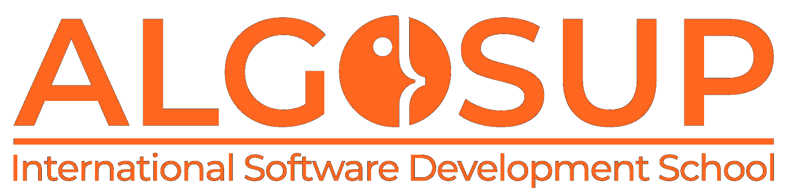

# Adopte Un Candidat - Team 7

This project is a student project provided by [we are evolution](https://www.we-are-evolution.com/) via [ALGOSUP](https://algosup.com/). The objective is to create the front-end of an app whose objective is to allow companies to recruit employees based on their soft-skills in an anonymous way.

## The Team

| Name | Role | Image | GitHub | Linkedin |
| :--- | :---: | --- | :---: | :---: |
| GROSSO Jason | Project Manager |  | [Jason's GitHub](https://github.com/JasonGROSSO) | [Jason's Linkedin](https://www.linkedin.com/in/jason-grosso-847b39251/) | 
| CUAHONTE-CUEVAS David | Program Manager |  | [David's GitHub](https://github.com/DavidCC812) | [David's Linkedin](https://www.linkedin.com/in/david-cuahonte-527781221/) |
| CHARTIER Léo | Tech Lead |  | [Léo's GitHub](https://github.com/leo-chartier) | [Léo's Linkedin](https://www.linkedin.com/in/l%C3%A9o-chartier/) |
| LAGUENS Manech | Technical Writer |  | [Manech's GitHub](https://github.com/Manech-Laguens) | [Manech's Linkedin](https://www.linkedin.com/in/manech-laguens-020127293/) |
| DEBRY Robin | Software Engineer |  | [Robin's GitHub](https://github.com/robin-debry) | [Robin's Linkedin](https://www.linkedin.com/in/robin-debry/) |
| ARCHIMBAUD Malo | Quality Assurance |  | [Malo's GitHub](https://github.com/Malo-Archimbaud) | [Malo's Linkedin](https://www.linkedin.com/in/malo-archimbaud-58aa12232/) |

## Documentation

Here is the list of all the main documents of this project:
- [Management Documents](https://github.com/algosup/2023-2024-project-5-flutter-team-7/tree/docs/docs/management)
- [Functional Specifications](https://github.com/algosup/2023-2024-project-5-flutter-team-7/tree/docs/docs/specs)
- [Technical Specifications](https://github.com/algosup/2023-2024-project-5-flutter-team-7/tree/docs/docs/specs)
- [Quality Assurance](https://github.com/algosup/2023-2024-project-5-flutter-team-7/tree/docs/docs/qa)

-----

<a property="dct:title" rel="cc:attributionURL" href="https://github.com/algosup/2023-2024-project-5-flutter-team-7">Adopte Un Candidat</a> by <a rel="cc:attributionURL dct:creator" property="cc:attributionName" href="https://www.we-are-evolution.com/">WeAreEvolution</a> is licensed under <a href="https://creativecommons.org/licenses/by-nc-nd/4.0/?ref=chooser-v1" target="_blank" rel="license noopener noreferrer" style="display:inline-block;">CC BY-NC-ND 4.0</a>

## Misc

Flutter version: 3.19.5
Credentials: In terms of credential, there is no credential
Device used in testing: 
- Readmi Note 9
- Iphone 15 Pro Max (emulator)
- Pixel 3A (emulator)
- Pixel 8 (emulator)