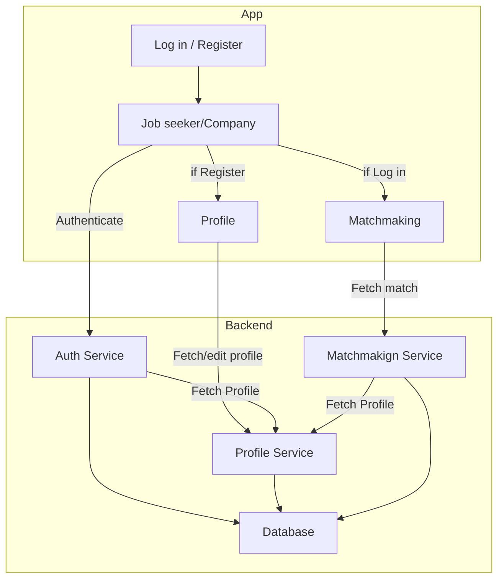

# Technical specifications

Table of Content

- [Introduction](#introduction)
  - [Project description](#project-description)
  - [Goals](#goals)
  - [Scope and future](#scope-and-future)
- [Technical Architecture](#technical-architecture)
  - [Technology Stack](#technology-stack)
  - [Architecture](#architecture)
  - [Internal APIs](#internal-apis)
  - [External APIs](#external-apis)
  - [Requests](#requests)
  - [Database](#database)
- [Development](#development)
  - [Requirements](#requirements)
  - [Coding standards](#coding-standards)
  - [Snippets](#snippets)
- [Testing](#testing)
- [Deployment](#deployment)
  - [Maintenance and Support](#maintenance-and-support)
- [Glossary](#glossary)

## Introduction

### Project description

Adopte Un Candidat is a mobile and desktop app made to ease the recruitment process. \
How the application works will resemble [Tinder](https://tinder.com/) with a swiping mechanic.

It is a request from We Are Evolution, a French company based in Châteauroux that provides advice to companies for their recruitment.

The matchmaking will be based solely on soft skills to allow companies to recruit candidates even if they do not have diplomas or experience. Additionally, to avoid discrimination and potential biases, the profiles of both the candidates and the companies are anonymized.

The mobile application targets any person looking for a job, while the desktop version is intended for companies that have difficulties filling a position with the usual recruitment methods.

### Goals

Our goals for the application are by order of priority:
1. Allow the matchmaking of job-seekers and companies
2. Selection of soft skills for both parties
3. Further customization of one's profile
 - Possibility to geolocate or manually input your address
4. Possibility for companies to have multiple offers at once
5. Language selection
6. Have both a mobile (job-seeker-focused) and a desktop (recruiter-focused) version of the application

### Scope and future

Our task for this project is only to create the interface the users will use. The backend with all the algorithms and logistics is up to our client to decide and create. \
We have to create a mockup system with basic functionality and fake data to test our application.

Since our timeframe for this project is quite short, uploading our app on Apple's AppStore or Google Play might prove difficult. For this reason, distributing the application to those marketplaces is not our priority and will not be done. \
If a decision is taken to do otherwise, we will update this document as needed.

Similarly, making our application responsive and fully working on mobile, tablets, and computers will require a lot of time. For this reason, it is the last goal on our list and might even be a future improvement.

Finally, some companies may get a lot of matches. For them, it would be imperative to have the possibility of automatic matchmaking. This task is not our priority and is out of scope.

One aspect to keep in consideration is our lack of budget. As such, we are unable to use any expensive tool or service. The only acceptable expense is the Google Play fee.

## Technical Architecture

### Technology Stack

To design the front end of our application, we will use [Flutter](https://flutter.dev/), a framework for [Dart](https://dart.dev/) created by Google.

As for the backend, we will create a quick and temporary solution using [Pocketbase](https://pocketbase.io/). Since we are not managing the backend, the interactions and responses will be hard coded.

### Architecture

Our application will follow the MVVM (Model-View-ViewModel) architecture pattern with a provider design pattern. It will be done using the [Riverpod](https://riverpod.dev/) library.

> [!NOTE]
> Since the distinction between the job-seeker and the company sides are similar, only one side is shown to keep the graph simple.

### Internal APIs

We will use three categories of endpoints for this application.

**Authentication**

The first step is to authenticate the user. There are two ways to do so:
- `/auth/login` (POST)
- `/auth/register` (POST)

There will also be one endpoint to log out:
- `/auth/logout` (POST)

**Profile**

There will be two endpoints to access a profile, depending on the user type:
- `/profile/user` (GET/POST/PUT/DELETE)
- `/profile/company` (GET/POST/PUT/DELETE)

**Matchmaking**

There are two endpoints for matchmaking:
- `/match/user` (GET/POST)
- `/match/company` (GET/POST)

The POST method should return whether there is a match or not. Requests from the company side should also include the ID of the job offer that is targeted.

### External APIs

We will add a button to log in via a Google account to ease the login process.

This step can easily be implemented using PocketBase. 

<!-- How to set it up -->

For security reasons, to obtain access to the credentials or the application's dashboard, please contact the technical leader in charge, [Léo CHARTIER](mailto:leo.chartier@algosup.com).

### Requests

Both the mock and the client's future backend should follow these rules:

- Matchmaking requests should have an `id` parameter referring to a temporary UUID to identify the request.
- Other data, such as user skills, should be included in the request/response body.

Although not a priority, authorization can be handled using the `Authorization` header field. For simplicity, we will use the basic authentication scheme ([documentation](https://developer.mozilla.org/en-US/docs/Web/HTTP/Headers/Authorization#basic_authentication)).

### Database

The database should contain the following tables and fields:

**LOCALIZATION**
| Field   | Description                               |
| ------- | ----------------------------------------- |
| ENGLISH | Primary, original text                    |
| FRENCH  |                                           |
| [More]  | More languages can be added in the future |

**USER**
| Field       | Description                                |
| ----------- | ------------------------------------------ |
| ID          | Primary, UUID                              |
| FIRST_NAME  |                                            |
| LAST_NAME   |                                            |
| LANG        | Last selected language, defaults to French |
| BIRTHDATE   | Integer in the `YYYYMMDD` format           |
| COUNTRY     |                                            |
| ADDRESS     | Full postal address                        |
| SOFT_SKILLS | Comma-separated list of soft skills        |
| HOBBIES     | Comma-separated list of hobbies            |
| EMAIL       |                                            |
| PASSWORD    | Plain text, for now, hashed in the future  |
| CREATED     | Timestamp                                  |
| DELETED     | Nullable timestamp                         |

**COMPANY**
| Field    | Description                               |
| -------- | ----------------------------------------- |
| ID       | Primary, UUID                             |
| NAME     | Company name                              |
| COUNTRY  |                                           |
| ADDRESS  | Full postal address                       |
| EMAIL    |                                           |
| PASSWORD | Plain text, for now, hashed in the future |
| CREATED  | Timestamp                                 |
| DELETED  | Nullable timestamp                        |

**OFFERS**
| Field       | Description                                          |
| ----------- | ---------------------------------------------------- |
| ID          | Primary, UUID                                        |
| COMPANY_ID  | The UUID of the company                              |
| TITLE       | Title of the job to be easily recognizable           |
| LOCATION    | Where the job is, if different from the company's HQ |
| SOFT_SKILLS | Comma-separated list of soft skills                  |

**MATCH**
| Field            | Description                                      |
| ---------------- | ------------------------------------------------ |
| ID               | Primary, UUID                                    |
| USER_ID          | UUID of the user                                 |
| COMPANY_ID       | UUID of the company                              |
| USER_RESPONSE    | 0 if not seen yet, 1 if accepted, -1 if rejected |
| COMPANY_RESPONSE | Same as above                                    |

## Development

### Requirements

The code can be developed on any IDE but the following instructions will focus on Visual Studio Code.

Those instructions are taken from the official [Flutter installation documentation](https://docs.flutter.dev/get-started/install).

1. If you have not done so already, download [Git](https://git-scm.com/downloads).
2. First, ensure your VSCode is up to date. Then install the [Flutter extension](vscode:extension/Dart-Code.flutter).
3. Then open the Command Palette (Ctrl/⌘+Shift+P), run `Flutter: New Project`, and click on the **Download SDK** button.
4. Select a path not containing spaces or requiring elevated privileges.
5. On Windows, once the installation is complete, you may click on **Add SDK to PATH** if you wish to.

To ensure the code works properly, please also install the Android emulator:

1. If you do not have it already, download [Android Studio](https://developer.android.com/studio).
2. On the welcome page, click on **More Options**, then **Virtual Device Manager**
3. On the new window, click on **Create virtual device**, select a device from the list, and hit **Next**
4. Select (and download) a system image and continue the setup until the end.
5. Back in VSCode, start debugging the program. A list of available devices will appear. Select the emulator you just created.

### Coding standards

Coding standards are available in our [contribution document](../../CONTRIBUTING.md).

### Snippets

To get started with the code, here are some templates.

> [!NOTE]
> This section will be filled later since these can easily be extracted from the code of our courses.

## Testing
<!-- Type (unit, integration, ...) -->
<!-- Tools -->
<!-- Bug tracking -->

## Deployment

The application will be made available on the Play Store for Android, in a beta stage.
We do not yet plan a release to Apple's App Store for now.

The release process is very well described in length in [Flutter's documentation](https://docs.flutter.dev/deployment/android).

To help with this process, we will create a GitHub Action to automate the building and release process. This workflow will run whenever a new tag is created on the release branch (`main` in our case).
This workflow will be available [here](../../.github/workflows/build_and_deploy.yml).

### Maintenance and Support

To ease the handover of the project to the client,
- we will provide in this repository all the code, databases, and other tools used,
- the code will be commented on regularly in a useful manner (~10% comments recommended),
- we will pitch a presentation of the product to the client to ensure they understand it, and provide a user manual.

Later customer support and maintenance on the application will have to be handled by the client. Despite this, we would be happy to provide further help, whether it is on expanding the project or improving the design.

## Glossary
<!-- TODO -->